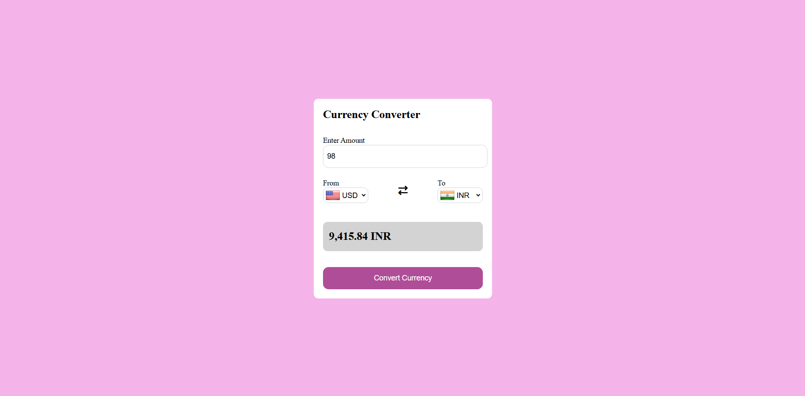

# 💱 Currency Converter

A clean, minimal currency converter web app built with HTML, CSS, and vanilla JavaScript.

## 🔗 Live Demo

[View Live](https://ashutosht0210.github.io/Currency-Converter/)

## 🌐 Live Features

- Convert between 150+ world currencies
- Live exchange rates fetched from the [Frankfurter API](https://frankfurter.dev/) (no API key required)
- Flag icons for each currency using [Flags API](https://flagsapi.com/)
- Swap currencies instantly with the ⇄ button
- Formatted result using Indian number formatting

## 🛠️ Built With

- HTML5
- CSS3
- Vanilla JavaScript (async/await, Fetch API, DOM manipulation)
- [Frankfurter API](https://frankfurter.dev/) — free, open-source exchange rate API
- [Flags API](https://flagsapi.com/) — country flag images
- [Font Awesome](https://fontawesome.com/) — icons

## 📁 Project Structure

```
currency-converter/
├── index.html      # Main HTML structure
├── style.css       # Styling
├── script.js       # Main JS logic
├── code.js         # Country/currency code mappings
├── LICENSE         # MIT License
└── images
    ├──screenshot.jpg
```

## 🚀 How to Run

1. Clone the repository:
   ```bash
   git clone https://github.com/ashutosht0210/Currency-Converter.git
   ```
2. Open `index.html` in your browser — no build steps or installs needed!

## 📸 Screenshot



## 🧠 What I Learned

- Fetching data from a REST API using `fetch()` and `async/await`
- DOM manipulation (creating elements, updating attributes)
- Handling asynchronous code with `.then()` and Promises
- Debugging JavaScript (scope issues, form submission behavior, event listeners)
- CSS layout with Flexbox

## 📄 License

This project is open source and available under the [MIT License](LICENSE).